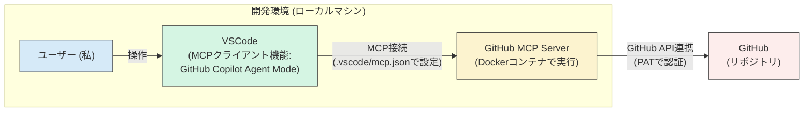

## 1. はじめに

最近、LLM界隈で話題の MCP (Model Context Protocol) について、様々な入門記事を目にするようになりました。正直なところ、私自身まだMCPについてよく分かっていなかったので、多くの記事のようにサーバー自作から入るのではなく、まずは既存の仕組みを使って手軽に体験することから始めたいと考えました。

この記事では、まさにその「自分でコードを一切書かずに、既存のツールだけでMCPを試してみる」という点にフォーカスします。私が実際に試した手順、その中での試行錯誤、そして実際に動かしてみた様子をまとめています。

具体的にはVSCodeと、GitHub公式が提供するMCPサーバー(Docker)という、「追加費用なし」かつ「実装不要」な組み合わせでどこまでできるのかを探求しました。

本記事の内容は、以下の主要な環境・バージョンで試した際の結果に基づいています。バージョンによって挙動が異なる可能性がある点にご留意ください。

-   VSCode: 1.99.3
-   GitHub Copilot 拡張機能: 1.309.0
-   Docker: 28.0.4
-   GitHub MCP Server (Docker Image): ghcr.io/github/github-mcp-server (0.2.1)

## 2. 「追加費用なし・実装不要」で試せる環境を探す

『はじめに』で述べたように、まずは手軽にMCPを体験することを目標にしました。そこで次に取り組んだのが、「どうやって試すか？」、つまり試用環境の選定です。新しい技術を学ぶ上で、実際に手を動かしてみるのが一番ですが、そのためには環境構築のハードルが低いことが重要だと考えました。

私がMCPを試す環境を選ぶ上で重視したポイントは以下の3つです。

1.  **追加費用がかからないこと**
    -   個人の調査なので、できればコストゼロで試したいと考えました。
2.  **普段使っているツールが使えること**
    -   使い慣れた環境が理想的です。
3.  **自分でコードを書かなくて済むこと**
    -   まずはMCPがどんなものか体験することに集中したいため、クライアントもサーバーも既存のものを利用したいと考えました。

これらの条件を満たす組み合わせを探した結果、以下の構成にたどり着きました。



*(図: 今回試した環境構成。ローカルのVSCodeから、同じくローカルのDocker上で動作するGitHub MCP Serverに接続し、GitHubと連携する)*

**選定した環境:**

-   **MCPクライアント側:** VSCode の GitHub Copilot Agent Mode
    -   **理由1: 普段使いのエディタであること。**
        私は日常的にVSCodeを利用しており、新たなツールを導入することなく、使い慣れた環境で試せるのは大きな利点でした。
    -   **理由2: Agent ModeによるMCPサポート (Preview)。**
        VSCode (GitHub Copilot拡張機能) にAgent Modeが導入され、プレビュー機能としてMCPサーバーとの連携をサポートしていることが[公式ドキュメント](https://code.visualstudio.com/docs/copilot/chat/mcp-servers)で発表されていました。「普段のエディタでMCPが試せる」というのは、試用への心理的ハードルを大きく下げてくれたため、これが大きな決め手となりました。
-   **MCPサーバー側:** GitHub公式提供の MCP Server (Docker)
    -   **理由1: 実装不要であること。**
        GitHubが公式に[Dockerイメージ](https://github.com/github/github-mcp-server)を提供しているため、自分でサーバーサイドのコードを書かずに済むのが大きなメリットでした。
    -   **理由2: 普段利用するGitHubを試せること。**
        連携対象が、日頃から使っている身近なGitHubであるため、MCPを使って具体的にどんなことができるのかをイメージしやすく、試しやすいと考えました。

この「VSCode + Docker + GitHub公式MCP Server」という組み合わせであれば、追加費用やクライアント/サーバー双方の実装が不要で、普段の開発環境から地続きでMCPの世界を体験できると判断し、この環境で試してみることにしました。


## 3. 実際に試したこと

試用する環境として「VSCode と Docker 上の GitHub MCP Server」を選び、いよいよセットアップの開始です。

大まかな流れとしては、まずGitHub側で必要な準備を行い、次にDockerでMCPサーバーコンテナの起動を確認（ここは少し試行錯誤がありました）、最後にVSCodeから接続するための設定、というステップで進めました。

手順自体はそれほど複雑ではないはずですが、実際に手を動かしてみると、特に GitHub MCP Server 周りの設定や起動で、ドキュメント通りにいかない部分や想定外の挙動にいくつか遭遇しました。その過程を記録しておきます。

まずは、最初のステップであるGitHub側の準備から始めます。

### 3.1. 事前準備: GitHubリポジトリとPAT

まず、MCPサーバーからGitHubを操作するための準備として、以下の2点を行いました。

1.  **操作対象のリポジトリ作成:**
    MCPサーバーから実際にIssue作成などの操作を試すための対象として、GitHub上にリポジトリを準備しました。今回は `your-repo-name` という名前の空のリポジトリを手動で作成しました。（※ご自身の試用時には、任意のリポジトリ名に置き換えてください）

2.  **Personal Access Token (PAT) の準備:**
    次に、GitHub MCP Server がこのリポジトリ (`your-repo-name`) と通信するために必要な認証情報、Personal Access Token (PAT) を準備します。
    -   GitHub の 設定 > Developer settings > Personal access tokens > Fine-grained tokens ([https://github.com/settings/personal-access-tokens](https://github.com/settings/personal-access-tokens)) から新しいトークン（Fine-grained personal access token）を生成しました。
    -   トークン生成時には、対象リポジトリを `your-repo-name` に限定し、必要な権限（今回は Issues の Read & Write）のみを選択しました。このように、権限は最小限に設定しました。

### 3.2. 事前確認: DockerでのGitHub MCP Server起動とツールセット指定

*(注: このセクションは、私が行ったDockerイメージの単体起動確認についての記録です。VSCodeとの連携においては必須の操作ではないため、次のセクション3.3から読み進めていただいても構いません。)*

GitHub側の準備が完了したので、次に GitHub MCP Server の Docker イメージ自体が、私のローカルのDocker環境で問題なく起動するかどうか、基本的な動作確認をしておきたいと考えました。

その際、最初から 「実行できるツールをIssueとPull Request関連に限定したい」 という考えがありました。LLMが利用できるツールは少ない方が、意図しない動作を防ぎやすいと考えたためです。

そこで、公式 README を参考に、環境変数 `GITHUB_TOOLSETS` を使ってツールセットを指定する以下のコマンドをターミナルで実行してみました。

```bash
docker run -i --rm \
  -e GITHUB_PERSONAL_ACCESS_TOKEN="YOUR_PAT_HERE" \
  -e GITHUB_TOOLSETS="issues,pull_requests" \
  ghcr.io/github/github-mcp-server
```
*(YOUR_PAT_HERE は先ほど生成した PAT に置き換えます)*

**【いきなりエラー発生】**

しかし、このコマンドを実行すると、期待に反して以下のようなエラーメッセージが表示され、起動に失敗してしまいました。 (GitHub MCP Server `v0.2.1` 時点)

```
# 実際に出力されたエラー (一部抜粋)
Failed to initialize toolsets: toolset issues,pull_requests does not exist
```

**【原因調査と解決策の発見 via GitHub Issues】**

原因が分からなかったため、GitHubリポジトリ ([github/github-mcp-server](https://github.com/github/github-mcp-server)) の Issues を検索してみました。すると、まさに同じエラーを報告している Issue ([#307](https://github.com/github/github-mcp-server/issues/307)) を発見しました。

このIssue (#307) は既にCloseされており、修正自体はリポジトリにマージされているようでしたが、私が試した最新リリース版 (v0.2.1) にはまだその修正が含まれていなかったようです。 そのため、依然として GITHUB_TOOLSETS 環境変数での指定が期待通りに機能しない状況でした。

幸いなことに、Issue内のコメントで回避策が共有されていました。 それは、環境変数ではなく、コマンドライン引数として `--toolsets` を使う方法でした。ただし、単純に引数を追加するだけでなく、Dockerコンテナ内で実行するコマンド (./github-mcp-server) とサブコマンド (stdio) を明示的に指定する必要があるとのことでした。

**【回避策の実行と成功】**

Issueで提示されていた回避策に従い、以下のコマンド形式で実行してみたところ…

```bash
# Issueで見つけた回避策コマンド
docker run -i --rm \
  -e GITHUB_PERSONAL_ACCESS_TOKEN="YOUR_PAT_HERE" \
  ghcr.io/github/github-mcp-server:0.2.1 \
  ./github-mcp-server stdio --toolsets issues,pull_requests
```

今度は、無事に指定したツールセット（`issues`, `pull_requests`）でサーバーが起動することを確認できました！

**【補足: ツールセット指定なしの場合】**

ちなみに、ツールセットを何も指定しない、最も基本的な以下のコマンドであれば、エラーなく起動することも確認しました。

```bash
docker run -i --rm \
  -e GITHUB_PERSONAL_ACCESS_TOKEN="YOUR_PAT_HERE" \
  ghcr.io/github/github-mcp-server
```

### 3.3. VSCodeでの設定と接続確認

Dockerコンテナの起動確認はできましたが、本題はVSCodeからMCPサーバーを利用することです。

**【VSCode設定】**

セクション3.2の試行錯誤により、Dockerの手動実行では `./github-mcp-server stdio --toolsets ...` という形式でツールセットを指定できることが分かっていました。VSCodeの設定 (`.vscode/mcp.json`) でも `args` を使ってこれを再現しつつ、認証にはVSCodeの `inputs` 機能を利用するように組み立てました。

最終的に動作した設定 (`.vscode/mcp.json`):

```json
{
  "inputs": [
    {
      "type": "promptString",
      "id": "github_token",
      "description": "GitHub Personal Access Token",
      "password": true
    }
  ],
  "servers": {
    "github": {
      "command": "docker",
      "args": [
        "run",
        "-i",
        "--rm",
        "-e",
        "GITHUB_PERSONAL_ACCESS_TOKEN",
        "ghcr.io/github/github-mcp-server",
        "./github-mcp-server",
        "stdio",
        "--toolsets",
        "issues,pull_requests"
      ],
      "env": {
        "GITHUB_PERSONAL_ACCESS_TOKEN": "${input:github_token}"
      }
    }
  }
}
```

この設定ファイルをワークスペースの `.vscode` ディレクトリに保存し、VSCodeのコマンドパレット (`Ctrl+ShiftP` または `Cmd+Shift+P`) から `GitHub Copilot: Reload MCP Servers` を実行するか、VSCodeを再起動して設定を読み込ませます。
`.gitignore` に `.vscode/mcp.json` を追加するなどして、設定ファイルが意図せずコミットされないように注意が必要です。

**【接続確認と実際の対話例】**

設定を読み込ませた後、初めてこのMCPサーバー (`github`) を利用しようとすると、VSCodeの上部に `"inputs"` 設定に基づき「GitHub Personal Access Token」の入力を求めるプロンプトが表示されます。ここに取得しておいたPATを入力してEnterキーを押します。

無事に認証が通ると、Copilot Chatビューの `Tools` ボタン（または `@workspace` 等の表示）をクリックした際に、設定したサーバー名 (`github`) が表示され、その配下に 絞り込まれたツール (`issues/create`, `pullRequests/list` など）が表示されることを確認できました。

実際にどのように動作するか、Copilot Chatで試した対話の様子を以下に示します。（ユーザー名やリポジトリ名は `your-username`, `your-repo-name` のように匿名化しています）

---
ユーザー: 以下のリポジトリにIssueを立ててみてください。
`https://github.com/your-username/your-repo-name`

GitHub との連携テストなので、Issue のタイトルや本文は適当に "検証のためです" といったような内容にしてみてください。

GitHub Copilot: GitHub Issueを作成する作業を行います。
*(Copilotが `github` サーバーの `issues/create` ツール使用の確認ダイアログを表示 → ユーザーが「Continue」をクリック)*

... (Copilotによる処理状況の説明) ...

与えられたURLから:
- owner: your-username
- repo: your-repo-name

以下の内容でIssueを作成します。Issueの作成が完了しました。

作成されたIssueの詳細:
- Issue番号: #1
- タイトル: "GitHub APIの動作検証"
- 状態: オープン
- URL: `https://github.com/your-username/your-repo-name/issues/1`

無事にIssueが作成され、リポジトリ上で確認できる状態となっています。

---
ユーザー: Issue がたてられているようなので、テストコメントを入れて、クローズしてみてください。

GitHub Copilot: はい、先ほど作成したIssueにコメントを追加し、その後クローズする作業を行います。
*(Copilotが `github` サーバーの `issues/create_comment` および `issues/update` ツール使用の確認ダイアログを表示 → ユーザーが「Continue」をクリック)*

... (Copilotによる処理状況の説明) ...

実施した作業:
1. コメントの追加
   - テストコメントを正常に投稿できました
2. Issueのクローズ
   - Issue #1を正常にクローズできました

すべての操作が正常に完了し、Issue #1は「closed」状態となっています。

---

このように、Copilotに対して自然言語で指示を出すだけで、GitHub MCPサーバーが提供するツールが適切に呼び出され、GitHub上の操作が実行されることを確認できました。

セットアップには調査や試行錯誤がありましたが、目的の環境が構築できて満足です。

## 4. まとめ

今回は、VSCodeとDocker上のGitHub MCP Serverを使って、コードを書かずにMCPを追加費用なしで体験する手順と、その過程での試行錯誤についてまとめました。セットアップにはいくつか躓きポイントもありましたが、無事にCopilotからGitHubを操作できる環境を構築でき、MCPが実際に動作する様子を掴むことができました。

この記事では、まずは「自分でコードを一切書かずに、既存のツールだけでMCPを試してみる」という最初のステップにフォーカスしました。既存のクライアント(VSCode)とサーバー(GitHub公式Docker)を組み合わせることで、MCP連携の基本的な流れを体験できたのは大きな収穫です。

しかし、MCPの仕組みをより深く理解するためには、やはり自分でサーバーサイドを実装してみるのが近道だと感じています。次回は、簡単なMCPサーバーを自作することに挑戦し、プロトコルの詳細やサーバー実装の勘所について、さらに学びを深めていきたいと考えています。

## 補足
* VSCode の MCP サポートは現在プレビュー版であり、仕様や挙動は今後変更される可能性があります。
* GitHub MCP Server のツールセット指定に関する挙動（v0.2.1）についても、今後のバージョンで改善される可能性があります。
