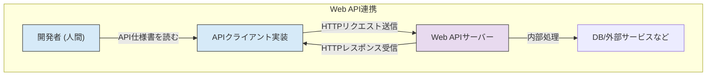
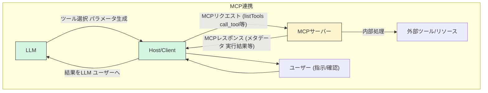
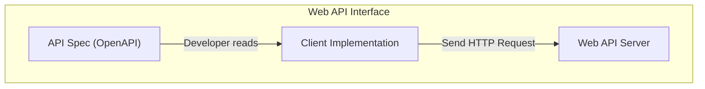
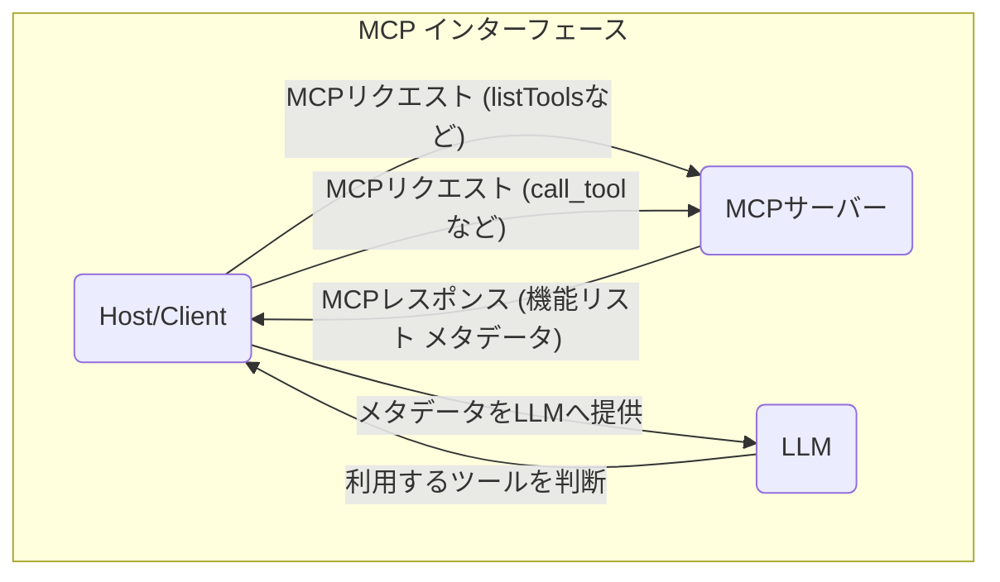

## はじめに

最近、LLM (大規模言語モデル) を活用したアプリケーション開発が急速に進む中で、「MCP (Model Context Protocol)」という言葉を耳にする機会が増えてきました。外部のツールやデータソースと LLM を連携させるためのオープンプロトコルとして注目されています。

Web API、特に REST API の開発に慣れ親しんでいる私は、MCP の話を聞いたときに「これも一種の API サーバー開発のようなものかな？」と感じていました。リクエストを受け取り、処理を実行し、レスポンスを返すという点では、確かに似ている部分もあります。

しかし、MCP の仕様や設計思想を詳しく見ていくと、Web API とは目的も仕組みも大きく異なる点が多く、LLM との連携を前提とした独自の考え方やルールがあることに気づきました。

この記事では、Web API 開発の経験を持つ開発者の方々を主な対象として、MCP と Web API を様々な角度から比較し、

-   両者の設計思想や目的は何が違うのか？
-   インターフェースの定義や発見方法はどう異なるのか？
-   開発プラクティス（サーバー/クライアント）にはどんな違いがあるのか？
-   そして、その違いから見えてくる MCP ならではの可能性とは何か？

といった点について、私の現時点での理解と考察を述べていきます。Web API との比較を通して、MCP の本質的な価値や開発のポイントを理解するための一助となれば幸いです。

## 設計思想と目的：「誰のため」「何のため」のインターフェースか？

Web APIとMCPの設計思想や目的の違いを、以下の表にまとめます。

| 観点         | Web API (REST)                           | MCP                                      |
|--------------|-------------------------------------------|-------------------------------------------|
| 主な対象     | 人間（開発者）                            | LLM（AI）                                 |
| 目的         | システム間連携・データ交換                | LLMによる外部ツール利用エコシステム構築   |
| インターフェース定義 | OpenAPI等の静的ドキュメント           | 動的なメタデータ・プロトコル               |
| 重視点       | 開発者の使いやすさ・統一性・スケーラビリティ| 発見性・理解性・安全性・拡張性            |

### Web API (特に REST API) の設計思想

一般的な Web API (ここでは主に REST API を念頭に置きます) は、主に「人間 (開発者)」が、「アプリケーション間でリソースを操作・連携する」ことを目的とした技術的なインターフェースと言えるでしょう。

-   対象: 主に人間 (開発者) が理解し、利用することを想定しています。
-   目的: アプリケーション間のデータ交換や機能連携を可能にし、システムを疎結合に保つこと。
-   重視される点: 開発者の使いやすさ、ステートレス性、統一インターフェース、スケーラビリティなどが設計原則として重視されます。
-   インターフェース定義: OpenAPI (Swagger) などで API の仕様を定義し、開発者はそのドキュメントを読んで実装を進めます。

*(図1: Web API連携の一般的な流れ。開発者が仕様を理解し、クライアントを実装する)*

### MCP の設計思想

一方、MCP は、主に「LLM (AI)」が、「外部のツールやコンテキストを自律的に発見し、理解し、利用できるエコシステムを構築する」ことを目的としたインターフェースです。

-   対象: 主に LLM (AI) が理解し、自律的に利用することを想定しています。
-   目的: LLM が外部世界のツールや情報に安全かつ効果的にアクセスし、その能力を拡張できる共通基盤を提供すること。
-   重視される点: LLM による機能の発見可能性、理解可能性、実行可能性、そしてエコシステム全体の安全性、構成可能性、拡張性などが設計原則として重視されます (例: ケイパビリティ交渉、Server のシンプルさ、分離性など)。
-   インターフェース定義: プロトコル自体が LLM との対話プロセスを定義しており、`listTools` などで動的に機能を発見し、提供されるメタデータ (description, parameters) を LLM が解釈して利用します。

*(図2: MCP連携の流れ。LLMがメタデータを基に判断し、Host/ClientがServerとMCPで通信する)*

### まとめ：目的の違いが本質的な違いを生む

このように、Web API と MCP は、そのインターフェースが「誰のため」で「何のため」に設計されているかという根本的な目的が異なります。Web API が主に人間開発者によるシステム間連携を目指すのに対し、MCP は LLM による自律的な外部ツール利用エコシステムの構築を目指しています。(図1と図2の比較参照)

この設計思想の違いが、プロトコルの詳細、提供される機能、開発における考慮点など、様々な側面での具体的な違いを生み出していると言えるでしょう。
(MCPの具体的な特徴については、続くセクションでWeb APIと比較しながら詳しく見ていきます。)

## インターフェースの技術的側面：定義・発見の仕組み

設計思想の違いは、Web API と MCP のインターフェースが技術的にどのように定義され、発見され、利用されるかという具体的な仕組みにも明確な差異を生んでいます。

### Web API: 静的な仕様定義と人間による解釈

Web API (特にREST API) のインターフェースは、多くの場合、OpenAPI (Swagger) 仕様のようなドキュメントによって静的に定義されます。

-   この仕様書には、エンドポイント、HTTPメソッド、リクエスト/レスポンスのスキーマなどが記述されます。
-   このドキュメントは主に人間 (開発者) が読み解き、APIクライアントの実装に役立てます。

*(図3: Web APIでは、開発者が静的な仕様書を元に実装する)*

### MCP: 動的な機能発見とLLMによるメタデータ解釈

一方、MCPのインターフェースは、LLMによる利用を前提とした、より動的な仕組みを持っています。

-   機能の動的発見: Host/Client は、Server に対して `listTools` や `listResources` といったメソッドを呼び出すことで、その時点で Server が提供する機能の一覧を動的に取得します。
-   LLM向けメタデータ: `list` 系メソッドの応答には、各機能の `description` (自然言語による説明) や `inputSchema` (JSON Schema形式のパラメータ定義) といったメタデータが含まれます。これらは、LLMが機能を理解し、利用方法を判断するために設計されています。

*(図4: MCPでは、動的に機能を発見し、LLMがメタデータを読んで利用を判断する)*

### 主な技術的差異のポイント

Web APIとMCPのインターフェース技術的な違いを表にまとめます。

| 観点         | Web API                                 | MCP                                      |
|--------------|-----------------------------------------|-------------------------------------------|
| 定義形式     | 静的なドキュメント（OpenAPI等）         | 動的なメタデータ（description, schema等） |
| 発見タイミング| 事前定義・静的                          | 実行時に動的発見                         |

## 開発プラクティス：プロトコル準拠とLLM連携の考慮点

MCPとWeb APIの設計思想やインターフェースの仕組みの違いは、実際の開発プラクティスにも影響を与えます。ここでは、Server開発とClient開発の両面から、MCP開発に取り組む際に特に意識すべき違いを見ていきましょう。

### MCP Server 開発における違い

Web APIサーバーの開発経験は、MCP Server開発にも大いに活かせますが、以下の点でMCP特有の考慮事項があります。

-   **プロトコルへの準拠:**
    -   Web API: パス設計やレスポンス形式などに比較的高い自由度があります。
    -   MCP: 厳格なMCPプロトコルに従う必要があります。
        -   `initialize`によるライフサイクル管理
        -   `listTools`, `call_tool`等の標準メソッド実装
        -   JSON-RPCベースのメッセージ形式
        -   stdio または Streamable HTTP の通信方式サポート
        -   (補足: FastMCPのようなフレームワークは負担軽減に役立つ可能性があります。)

-   **状態管理と通知:**
    -   Web API: ステートレスが推奨されることが多いです。
    *   MCP: オプションで`workspace/didChangeLists`のようなServerからClientへの非同期通知が定義されています。
        -   実装する場合、Serverは状態（ツールリスト等）を管理し、変更時にSSE等で通知する必要があります。

### MCP Client (Host/Connector) 開発における違い

次に、Client側の開発について、一般的なWeb APIクライアント開発と比較してみます。

-   **バックエンド連携の方法:**
    -   Web APIクライアント: 連携するAPIごとに異なるエンドポイントや形式に対応する必要があります。
    -   MCP Client: 連携するMCP Serverとは、基本的には統一されたMCPプロトコルで対話できます。
        -   多様なツール（Server）と連携する際の実装の複雑さを抑制できる可能性があります。

### まとめ：LLM連携を前提とした開発スタイル

MCPのServer/Client開発は、Web API開発のスキルを基礎としつつも、LLMとの連携を前提としたプロトコルへの準拠や、LLMを意識したメタデータ設計といった、独自の開発スタイルが求められます。単に機能を提供するだけでなく、「LLMにいかに効果的にツールを使ってもらうか」という視点が重要になるでしょう。

## MCPとWeb API：それぞれの役割と可能性

この記事では、Web API 開発の経験を持つ視点から、MCP (Model Context Protocol) と Web API (特に REST API) を比較し、その設計思想、インターフェース、開発プラクティスにおける主な違いについて考察してきました。

両者の主な違いは以下の通りです。

-   目的: Web API は人間開発者によるシステム間連携、MCP は LLM による自律的な外部ツール利用エコシステムの構築を目指します。
-   インターフェース: Web API は静的な仕様定義と人間による解釈、MCP は動的な機能発見と LLM が解釈可能なメタデータによる連携が特徴です。
-   開発プラクティス: MCP では厳格なプロトコル準拠や LLM を意識した設計が重要です。

それぞれが異なる得意分野を持ち、補完的な役割を担うと考えます。
