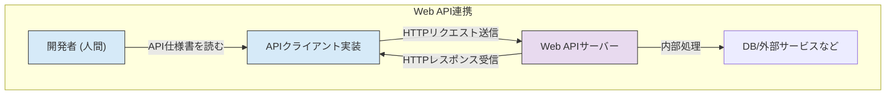
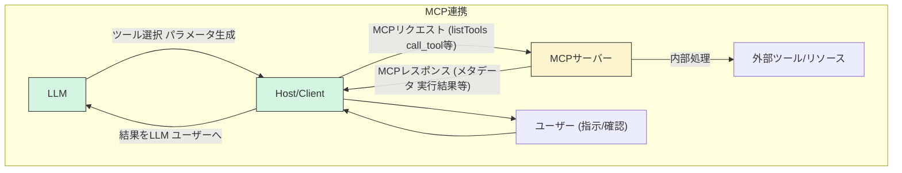

## はじめに

最近、LLM (大規模言語モデル) を活用したアプリケーション開発が急速に進む中で、「MCP (Model Context Protocol)」という言葉を耳にする機会が増えてきました。外部のツールやデータソースと LLM を連携させるためのオープンプロトコルとして注目されています。

Web API、特に REST API の開発に慣れ親しんでいる私は、MCP の話を聞いたときに「これも一種の API サーバー開発のようなものかな？」と感じていました。リクエストを受け取り、処理を実行し、レスポンスを返すという点では、確かに似ている部分もあります。

しかし、MCP の仕様や設計思想を詳しく見ていくと、Web API とは目的も仕組みも大きく異なる点が多く、LLM との連携を前提とした独自の考え方やルールがあることに気づきました。

この記事では、Web API 開発の経験を持つ開発者の方々を主な対象として、MCP と Web API を様々な角度から比較し、

-   両者の設計思想や目的は何が違うのか？
-   インターフェースの定義や発見方法はどう異なるのか？
-   開発プラクティス（サーバー/クライアント）にはどんな違いがあるのか？
-   そして、その違いから見えてくる MCP ならではの可能性とは何か？

といった点について、私の現時点での理解と考察を述べていきます。Web API との比較を通して、MCP の本質的な価値や開発のポイントを理解するための一助となれば幸いです。

## 設計思想と目的：「誰のため」「何のため」のインターフェースか？

Web API、特に REST API に慣れていると、外部の機能を提供する MCP Server も、その一種として捉えがちです。実際に、既存の API を呼び出すための「ラッパー」として MCP Server を実装することも可能です。

しかし、両者の根底にある設計思想や目的を比較すると、根本的な違いが見えてきます。この違いを理解することが、MCP の本質を捉える上で重要だと考えます。

### Web API (特に REST API) の設計思想

一般的な Web API (ここでは主に REST API を念頭に置きます) は、主に「人間 (開発者)」が、「アプリケーション間でリソースを操作・連携する」ことを目的とした技術的なインターフェースと言えるでしょう。

-   対象: 主に人間 (開発者) が理解し、利用することを想定しています。
-   目的: アプリケーション間のデータ交換や機能連携を可能にし、システムを疎結合に保つこと。
-   重視される点: 開発者の使いやすさ、ステートレス性、統一インターフェース、スケーラビリティなどが設計原則として重視されます。
-   インターフェース定義: OpenAPI (Swagger) などで API の仕様を定義し、開発者はそのドキュメントを読んで実装を進めます。

*(図1: Web API連携の一般的な流れ。開発者が仕様を理解し、クライアントを実装する)*

### MCP の設計思想

一方、MCP は、主に「LLM (AI)」が、外部のツールやコンテキストを自律的に発見し、理解し、利用できるエコシステムを構築することを目的としたインターフェースです。

-   対象: 主に LLM (AI) が理解し、自律的に利用することを想定しています。
-   目的: LLM が外部世界のツールや情報に安全かつ効果的にアクセスし、その能力を拡張できる共通基盤を提供すること。
-   重視される点: LLM による機能の発見可能性、理解可能性、実行可能性、そしてエコシステム全体の安全性、構成可能性、拡張性などが設計原則として重視されます (例: ケイパビリティ交渉、Server のシンプルさ、分離性など)。
-   インターフェース定義: プロトコル自体が LLM との対話プロセスを定義しており、`listTools` などで動的に機能を発見し、提供されるメタデータ (description, parameters) を LLM が解釈して利用します。

*(図2: MCP連携の流れ。LLMがメタデータを基に判断し、Host/ClientがServerとMCPで通信する)*

### まとめ：目的の違いが本質的な違いを生む

このように、Web API と MCP は、そのインターフェースが「誰のため」で「何のため」に設計されているかという根本的な目的が異なります。Web API が主に人間開発者によるシステム間連携を目指すのに対し、MCP は LLM による自律的な外部ツール利用エコシステムの構築を目指しています。(図1と図2の比較参照)

この設計思想の違いが、プロトコルの詳細、提供される機能、開発における考慮点など、様々な側面での具体的な違いを生み出していると言えるでしょう。MCP Server が単なる API ラッパーにとどまらない価値を持つ理由は、まさにこの設計思想の違いにあるのです。
(MCPの具体的な特徴については、続くセクションでWeb APIと比較しながら詳しく見ていきます。)
